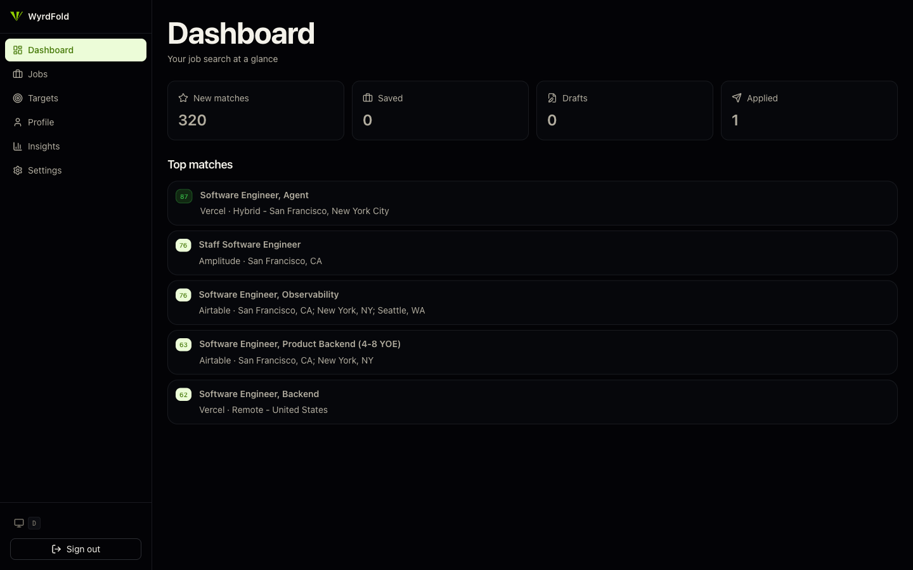
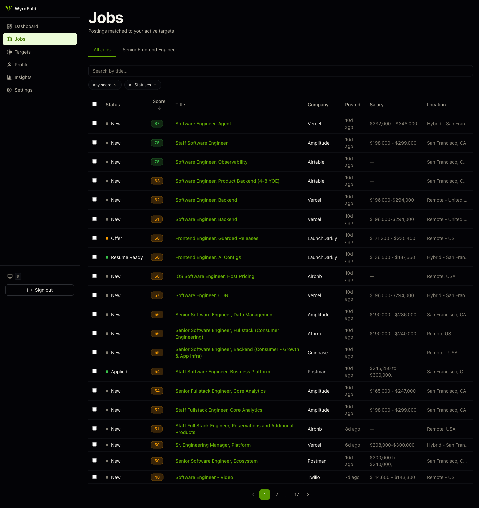
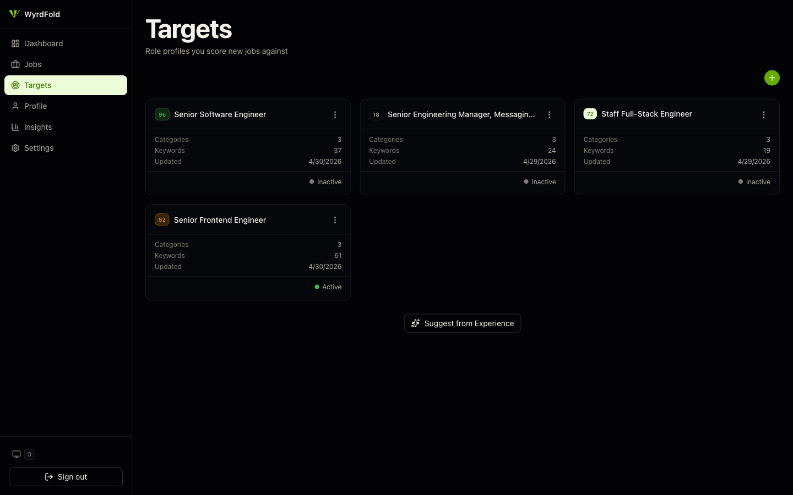

# WyrdFold

**Self-hostable, bring-your-own-key job-search automation.** WyrdFold polls
job boards (Greenhouse, Lever, Ashby, and more) against the roles you're
targeting, triages and grades every posting for fit with a two-phase LLM
pipeline, and helps you tailor resumes and cover letters for the matches
worth pursuing — all running on your own infrastructure with your own API
keys.

- **Target-driven discovery** — describe the roles you want; WyrdFold finds
  and polls the sources that post them.
- **Two-phase LLM matching** — a cheap title-triage pass gates an in-depth
  fit grade (skills / seniority / domain / title axes), with per-axis weights
  you can tune. Cost guardrails (hourly/daily/monthly budgets and a global
  circuit breaker) are built in.
- **Pipeline tracking** — saved → resume draft → applied → interviewing →
  offer, with insights dashboards over your funnel.
- **Resume & cover-letter tailoring** — grounded in your own experience
  profile, exported to DOCX.



<details>
<summary>More screenshots</summary>

**Jobs** — every polled posting, scored against your active targets:



**Targets** — the role profiles new jobs are scored against:



</details>

## License

WyrdFold is source-available under the
[Functional Source License, v1.1 (FSL-1.1-ALv2)](./LICENSE.md): you can
self-host, modify, and use it for anything except offering it as a competing
commercial service — and each release automatically becomes Apache-2.0 two
years on. Chosen to keep self-hosting genuinely free while reserving the
option of a hosted version.

## Architecture

| Project                 | Stack                                                         | Deploy           |
| ----------------------- | ------------------------------------------------------------- | ---------------- |
| **`apps/wyrdfold`**     | Next.js 16 (App Router), React 19, TypeScript, Tailwind CSS 4 | Vercel           |
| **`apps/wyrdfold-api`** | FastAPI (Python 3.11+), `uv` workspace                        | Railway (Docker) |
| **`apps/wyrdfold-e2e`** | Playwright E2E for the web app                                | —                |

- **Database & auth:** Supabase (Postgres + `pgvector`). Auth is **magic-link
  only**. CLI config lives in [`supabase/`](./supabase).
- **Web → API:** the Next.js app proxies to `wyrdfold-api`
  (`WYRDFOLD_API_URL`), forwarding the user's Supabase JWT as a Bearer token.
  The API verifies it against Supabase's JWKS endpoint (derived from
  `SUPABASE_URL`).

This is a standalone **Nx + pnpm** monorepo (polyglot: TypeScript + Python).
The design system is consumed as the published npm package
[`@danieljoffe/shared-ui`](https://www.npmjs.com/package/@danieljoffe/shared-ui).

## Self-hosting quickstart

What you need before starting:

- **Node.js 24.x** and **pnpm** (`packageManager` is pinned)
- **[uv](https://docs.astral.sh/uv/)** for the Python API
- **[Supabase CLI](https://supabase.com/docs/guides/cli)** and a free
  [Supabase](https://supabase.com) project (this is the database + auth —
  the only hard external dependency)
- An LLM API key — [Anthropic](https://console.anthropic.com) or
  [OpenRouter](https://openrouter.ai) — for real job grading. The API boots
  without one (`LLM_PROVIDER=mock`), but matching quality is the product.

### 1. Clone and install

```bash
git clone https://github.com/danieljoffe/wyrdfold.git
cd wyrdfold
pnpm install     # installs JS deps; postinstall runs `uv sync` for Python
```

### 2. Create the database

Create a Supabase project (dashboard → New project), then apply the schema:

```bash
supabase login
supabase link --project-ref <your-project-ref>
pnpm db:push     # applies supabase/migrations to your project
```

### 3. Configure environment

```bash
cp apps/wyrdfold/.env.example apps/wyrdfold/.env.local
cp apps/wyrdfold-api/.env.example apps/wyrdfold-api/.env
```

Each template documents required vs. optional variables. The short version:

| Variable                                     | Where        | Notes                                           |
| -------------------------------------------- | ------------ | ----------------------------------------------- |
| `SUPABASE_URL` + `SUPABASE_SERVICE_ROLE_KEY` | API          | Supabase dashboard → Settings → API             |
| `NEXT_PUBLIC_SUPABASE_URL` + `..._ANON_ID`   | web          | Same page, anon/publishable key                 |
| `WYRDFOLD_API_KEY`                           | both (match) | `openssl rand -hex 32`                          |
| `WYRDFOLD_API_URL`                           | web          | `http://localhost:8001` for local dev           |
| `LLM_PROVIDER` + the matching key            | API          | `anthropic` or `openrouter`; defaults to `mock` |

Everything else — Brave Search (source discovery), Firecrawl (JS-rendered
extraction), Voyage (embeddings), Twilio (SMS), Sentry, Resend alerts — is
**optional and degrades gracefully**: leave it unset and the feature is
skipped or mocked.

### 4. Run

```bash
pnpm nx dev wyrdfold-api    # FastAPI  → http://localhost:8001
pnpm nx dev wyrdfold        # web app  → http://localhost:3100
```

Or run the API in Docker instead (see [`docker-compose.yml`](./docker-compose.yml)):

```bash
docker compose up --build api
```

Open <http://localhost:3100>, sign in with a magic link (Supabase's built-in
email works out of the box for low volume), and the onboarding wizard takes
it from there: describe your target role, add your experience, and activate
the target.

### 5. Background polling (pick one)

Job sources are re-polled on a schedule. Two ways to drive it:

1. **Vercel cron** (default for the hosted setup) — `apps/wyrdfold/vercel.json`
   schedules `POST /api/jobs/poll` daily; set `CRON_SECRET` in the Vercel
   project. Nothing to do on the API side.
2. **Self-hosted scheduler** — no Vercel required: set
   `POLL_SCHEDULER_ENABLED=true` in the API env and the in-process
   APScheduler loop polls due sources every `POLL_TICK_MINUTES`.

You can also trigger a poll manually anytime from the app (or
`POST /poll` with the `x-api-key` header).

### Enabling the full LLM pipeline

The two-phase matching pipeline ships behind flags so you can validate cost
on your own targets first. With a real `LLM_PROVIDER` configured, set:

```bash
PHASE1_TRIAGE_ENABLED=true   # cheap LLM title triage at ingestion
PHASE2_ENABLED=true          # in-depth fit grading of promising jobs
```

Budgets (`USER_LLM_*_BUDGET_USD`, `GLOBAL_LLM_DAILY_BUDGET_USD`,
`PHASE2_DAILY_CAP`) default to conservative values — raise them once you've
seen a day of real spend in the in-app cost insights.

## Common commands

```bash
pnpm nx build wyrdfold                 # production build of the web app
pnpm nx test wyrdfold                  # web unit tests (Jest + RTL)
pnpm nx e2e wyrdfold-e2e               # Playwright E2E
pnpm test:python                       # API lint + typecheck + tests (ruff/mypy/pytest)
pnpm nx affected -t lint test build    # only what changed (base: main)
pnpm knip                              # unused files / deps / exports
```

Per-project targets are inferred by Nx — run `pnpm nx show project wyrdfold`
to list them. Remote build caching uses a Cloudflare R2 bucket via
`@nx/s3-cache` (set the R2 credentials in the environment to enable it;
falls back to local cache otherwise).

## Database (Supabase)

Migrations live in [`supabase/migrations`](./supabase/migrations). Common flows:

```bash
pnpm db:push        # apply local migrations to the linked project
pnpm db:gen-types   # regenerate apps/wyrdfold/src/lib/supabase/types.ts
```

## Production deployment

The reference deployment (any equivalent host works):

- **Web** → Vercel (`apps/wyrdfold/vercel.json`). Needs
  `NEXT_PUBLIC_SUPABASE_URL`, `NEXT_PUBLIC_SUPABASE_ANON_ID`,
  `WYRDFOLD_API_URL`, `WYRDFOLD_API_KEY`, and `CRON_SECRET`.
- **API** → Railway (`apps/wyrdfold-api/Dockerfile` + `railway.toml`), or any
  Docker host via `docker-compose.yml`. Set `ALLOWED_HOSTS` to your public
  domain(s) and `SENTRY_ENVIRONMENT=production` if using Sentry.

## Conventions

- A husky pre-commit hook runs `lint-staged` (ESLint + Prettier) and, when TS
  files are staged, `pnpm typecheck`.
- `main` is the trunk and the default base for `nx affected`.
